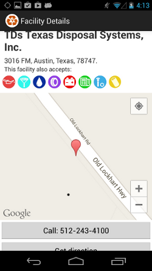
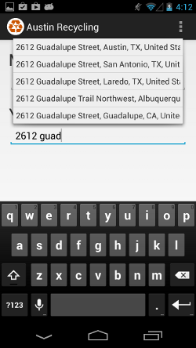

austin_recycling
================
Screenshots:
------------

Problem:
--------
You have dead batteries, scrap metal, and 
other strange materials to dispose of. You know you 
shouldn't throw them in the landfill, but you don't know 
where to take them.

Solution:
---------
The Austin Recycling App will inform users of 
the closest recycling facility that can handle their 
materials.

Team members:
--------------
* David Ouyang Moench
* Chan-Tang Hsu
* Alex Ng Dehe

Note:
-----
This app only works on a real device. AVD is not able to display Google Map v2.

Remember to include Google Play Library before you run the app. Here are the steps:

1. Make sure you download Google Play Services SDK in SDK Manager
2. File -> Import -> Android -> Existing Android Code into Workspace
3. Browse -> [your_android_sdk_directory]/extras/google/google_play_services/libproject/google-play-services_lib -> check 'Copy projects into workspace' -> Finish
4. Right click on our project -> properties -> Android -> At the bottom, the Library section -> Add -> google-play-services_lib -> OK
